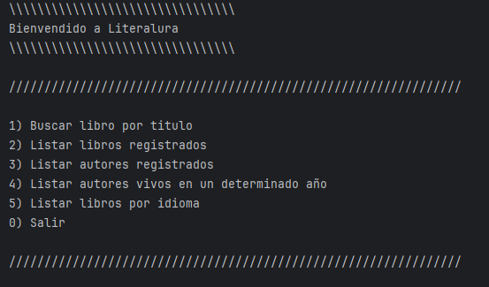
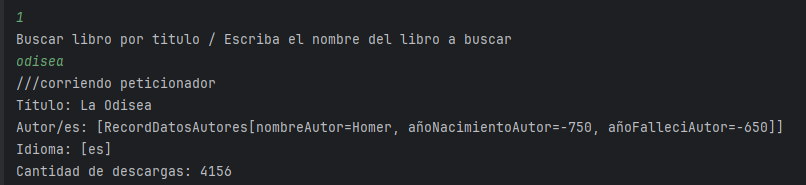
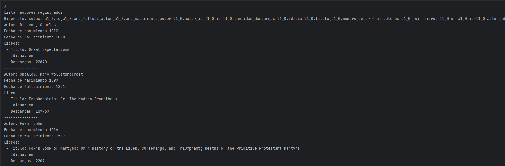
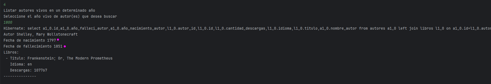
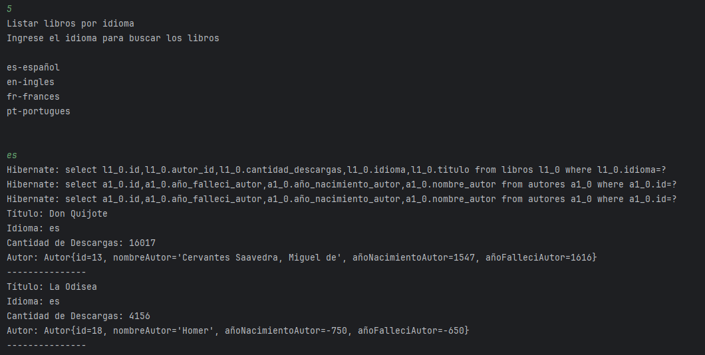

# Literalura  

---

## 📋 Índice  
1. [Descripción del Proyecto](#-descripción-del-proyecto)
2. [Configuracion del Proyecto](#-configuracion-del-proyecto)  
3. [Demostración de Funciones](#-demostración-de-funciones-y-aplicaciones)  
4. [Acceso al Proyecto](#-acceso-al-proyecto)  
5. [Tecnologías Utilizadas](#-tecnologías-utilizadas)  
6. [Personas Desarrolladoras del Proyecto](#-personas-desarrolladoras-del-proyecto)  

---

## 📝 Descripción del Proyecto  
**[Literalura]** es una aplicación que permite buscar información de libros por medio del API Gutendex y guardarla en una base de datos local PostgreSQL.

Por ejemplo:  
> "Obtener información del autor, cantidad de descargas, e idiomas del libro Frankestein. Adicionalmente podemos obtener los datos de año de nacimiento y defunción del autor correspondiente "

---

## 📝 Configuracion del Proyecto

- **Paso 1**: [Es necesario crear nuestro proyecto utilizando Spring Framework, asi como las depedencias PostgreSQL, Jackson-Databind].  

- **Paso 2**: [Deben de configurarse las variables de entorno en su sistema operativo para en enlace a las bases de datos, las cuales están referenciadas en el proyecto en el archivo aplication.properties en:

spring.datasource.username={DB_USER}

spring.datasource.password={DB_PASSWORD}

].  

---

## 🎥 Demostración de Funciones 
### Funciones Principales:  
- **Paso 1**: [Selecciono la opcion 1 y escribo el nombre del libro a buscar].  
- **Paso 2**: [Selecciono la opcion 2 para mostrar todos los libros almacenados en las bases de datos].  
- **Paso 3**: [Selecciono la opcion 3 para mostrar todos los autores almacenados en las bases de datos].
- **Paso 4**: [Selecciono la opcion 4 y escribo el año a elegir para visualizar solo los autores vivos en dicho año].
- **Paso 5**: [Selecciono la opcion 5 y escribo segun la nomenclatura mostrada el idioma para filtar solo los libros de dicho idioma].
- **Paso 6**: [Selecciono la opcion 0 para finalizar la aplicación].

---

### Vista Previa:  
 

---

## 🚀 Acceso al Proyecto  
Puedes acceder al proyecto mediante:  
- **Repositorio en GitHub**: [Enlace al repositorio](https://github.com/Jonathan-FCH/literalura)  

---

## 🛠️ Tecnologías Utilizadas  
- **Backend**: Java versión 17, Spring Boot Framework 3.4.1 Maven, Biblioteca Gson 2.10.1, 
---

## 👨‍💻 Personas Desarrolladoras del Proyecto  
- **Bryan Miguel Sanabria Vargas**  
  - [LinkedIn](linkedin.com/in/jonathan-fonseca-chacon)  
  - [GitHub](https://github.com/Jonathan-FCH) 

---